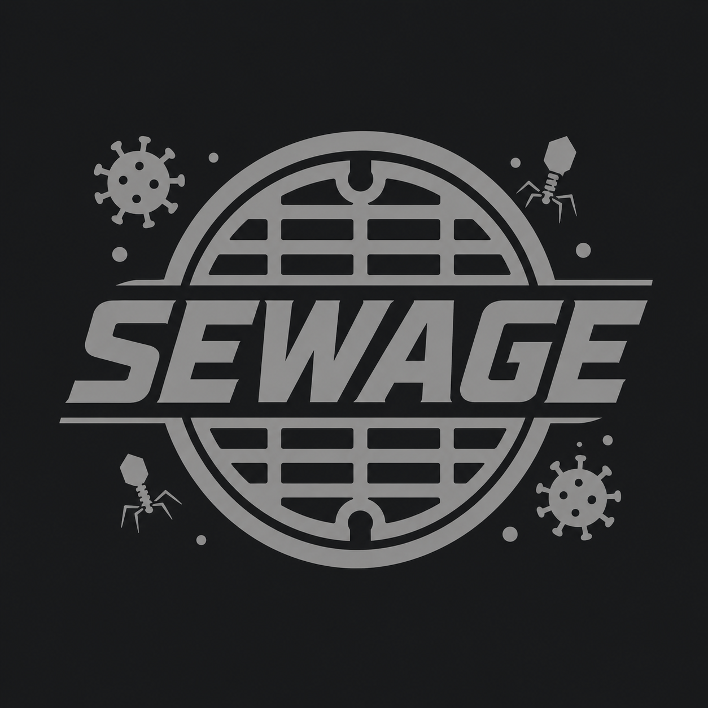

# SEWAGE

**S**imulated **E**mulation of **W**astewater-**A**bundance **G**enome **E**nsembles



SEWAGE simulates paired-end, wastewater-like FASTQ data for a defined mixture
of viral lineages. The reference genomes and lineage/mutation barcodes come from
the [Freyja-barcodes](https://github.com/andersen-lab/Freyja-barcodes) project,
but that data is **bundled inside SEWAGE** (the `data/` folder) — you never have
to clone it yourself. You supply a **pathogen name** and a table of **lineage
proportions**, and SEWAGE builds a full genome per lineage and emits reads so
that each lineage contributes in proportion to its requested abundance. Run
`./sewage.py --update` at any time to refresh the bundled data from upstream.

This is useful for benchmarking wastewater relative-abundance callers such as
[Freyja](https://github.com/andersen-lab/Freyja), where you need FASTQ data with
a **known ground-truth mixture** of lineages.

---

## Features

- **Self-contained barcode data** bundled under `data/` — no separate clone
  needed. `--update` downloads the latest upstream repo and rebuilds the local
  data (all pathogens, `latest` + dated versions), adding any new pathogens.
- Works for any pathogen present in the data (DENV1–4, MPX, RSVa/RSVb, MEASLES,
  influenza segments, MTB, etc.).
- Builds each lineage's genome by applying **all** barcode mutations flagged for
  that lineage (IUPAC ambiguity codes resolved to a concrete alt base).
- Proportions supplied via a CSV/TSV file **or** auto-generated
  (`equal` / `dominant` / `random`).
- Coverage controlled by fold-**depth** (`--depth`) or absolute **read-pair
  count** (`--num-pairs`).
- Configurable read length, fragment size distribution, and per-base error rate.
- Optional **realistic base-quality model** (`--quality-profile illumina`):
  per-base Phred scores whose mean declines and variance widens toward the 3'
  end (the default `flat` profile keeps constant quality). The quality model
  only sets the reported Phred scores — it never alters the read bases.
- **Base mutations are strictly opt-in.** By default reads are identical to
  their source lineage genome. Two independent switches introduce changes:
  `--error-rate` (a flat per-base error rate) and `--quality-errors` (mutate
  each base with probability `10^(-Q/10)` from its own Phred score, so a Q15
  base has ~3% chance of changing). Leave both off to keep perfect reads even
  while quality scores worsen along the read.
- Fast, `numpy`-vectorized read generation; gzip output by default.
- Writes a manifest of the exact realized proportions and read-pair counts.
- Optional QC plots (`--qc-plots`): read-length histogram, per-base
  depth-of-coverage line plot, and a FastQC-style per-base quality boxplot
  (positions 1-9 individual, then binned in groups of 5), written as PNGs into
  a folder.

---

## Requirements

- Python **3.8+** (developed on 3.12)
- [`numpy`](https://numpy.org/) (core dependency)
- [`matplotlib`](https://matplotlib.org/) (optional, only for `--qc-plots`)

Install the Python dependencies:

```bash
pip install -r requirements.txt
```

The barcode data ships bundled in `data/`. If it is missing (or you want the
latest), download/rebuild it — no manual clone required:

```bash
./sewage.py --update
```

SEWAGE finds the barcode data, in order of precedence:

1. the `--repo /path/to/data` flag,
2. the `FREYJA_BARCODES` environment variable,
3. the bundled `data/` folder sitting next to `sewage.py`.

```bash
export FREYJA_BARCODES=/path/to/data   # optional override
```

---

## Quick start

```bash
# 0. (once) Download / refresh the bundled barcode data
./sewage.py --update

# 1. See which pathogens are available in the bundled data
./sewage.py --list

# 2. See which lineages exist for a pathogen
./sewage.py -p DENV1 --list-lineages

# 3. Simulate a 3-lineage mixture at 100x depth from a proportions file
./sewage.py -p DENV1 -i proportions.csv --depth 100 -o DENV1_sample

# 4. ...or let SEWAGE auto-generate a dominant-strain mixture of 4 lineages
./sewage.py -p DENV1 --generate-proportions --num-lineages 4 \
            --prop-mode dominant --depth 100 -o DENV1_sample --seed 42
```

### Proportions file format

A two-column CSV or TSV (comma or tab auto-detected; an optional header is
ignored). Column 1 is the lineage name (must exist in the barcode file),
column 2 is its proportion. Values are normalized automatically, so they need
not sum to exactly 1.

```csv
lineage,proportion
DENV1-1I-H,0.6
DENV1-III,0.3
DENV1-V,0.1
```

Every requested lineage must exist in the barcode file; otherwise SEWAGE exits
with an error naming the missing lineage(s).

---

## Output

Every run writes into a single parent folder named `<output_prefix>_sewage/`.
For `-o sample` (gzip on by default), that folder `sample_sewage/` contains:

| File | Description |
|------|-------------|
| `sample_sewage/sample_R1.fastq.gz` | Forward reads |
| `sample_sewage/sample_R2.fastq.gz` | Reverse reads (reverse-complemented mates) |
| `sample_sewage/sample.proportions.tsv` | Manifest: requested proportion + realized read-pair count per lineage |

With `--qc-plots`, a QC subfolder (default `sample_sewage/sample_qc/`) is also
written:

| File | Description |
|------|-------------|
| `sample_sewage/sample_qc/sample.read_length_hist.png` | Histogram of read lengths produced |
| `sample_sewage/sample_qc/sample.coverage.png` | Per-base depth of coverage across the genome (line plot) |
| `sample_sewage/sample_qc/sample.per_base_quality.png` | FastQC-style per-base quality box-and-whisker plot (first 9 bases individual, then binned in groups of 5) |

Read names follow an Illumina-like scheme encoding the source lineage, e.g.:

```
@DENV1:DENV1-1I-H:0 1:N:0:1
```

---

## Command-line options

| Flag | Description | Default |
|------|-------------|---------|
| `-p`, `--pathogen` | Pathogen name as it appears in the data (e.g. `DENV4`, `MPX`, `RSVa`). | — |
| `--repo` | Path to the bundled barcode data directory. | `$FREYJA_BARCODES` or bundled `data/` |
| `--version` | Barcode version subfolder (e.g. `latest` or a date). | `latest` |
| `--list` | List available pathogens and exit. | — |
| `--list-lineages` | List available lineages for `--pathogen` and exit. | — |
| `--update` | Download the latest upstream repo and rebuild the bundled data, then exit. | — |
| `--update-repo` | GitHub `owner/name` to pull barcode data from. | `andersen-lab/Freyja-barcodes` |
| `--update-branch` | Branch of the barcode repo to pull. | `main` |
| `-i`, `--proportions` | CSV/TSV proportions file (`lineage,proportion`). | — |
| `--generate-proportions` | Auto-generate proportions instead of supplying a file. | — |
| `--num-lineages` | (generate) Number of lineages to include. | prompt |
| `--prop-mode` | (generate) `equal`, `dominant`, or `random`. | prompt |
| `--dominant-fraction` | (generate, dominant) Fraction for the dominant lineage. | random in [0.5, 0.8] |
| `--proportions-out` | Where to save the used/generated proportions table. | `<prefix>_sewage/<prefix>.proportions.tsv` |
| `--depth` | Target fold coverage for the whole sample. | — |
| `--num-pairs` | Total number of read **pairs** for the whole sample. | — |
| `--read-length` | Length of each mate. | `250` |
| `--fragment-mean` | Mean fragment (insert) size. | `500` |
| `--fragment-sd` | Std. dev. of fragment size. | `50` |
| `--error-rate` | Flat per-base error rate that mutates read bases (`0` disables). Independent of the quality profile. | `0.005` |
| `--quality-errors` | Also mutate bases using each base's own Phred score as its error probability (`P = 10^(-Q/10)`). Off by default. | off |
| `--quality-profile` | Base-quality model (Phred scores only, never the bases): `flat` (constant) or `illumina` (declines/widens toward 3'). | `flat` |
| `--quality-start` / `--quality-end` | (illumina) Mean Phred quality at the 5' / 3' end. | `38` / `30` |
| `--quality-sd-start` / `--quality-sd-end` | (illumina) Quality std. dev. at the 5' / 3' end. | `1` / `8` |
| `-o`, `--output-prefix` | Prefix for outputs; all files go into `<prefix>_sewage/`. | `sim_sample` |
| `--gzip` / `--no-gzip` | Gzip the FASTQ output (on by default). | gzip |
| `--gzip-level` | gzip compression level 1–9 (lower = faster). | `6` |
| `--seed` | Random seed for reproducibility. | — |
| `--qc-plots` | Generate QC PNGs (read-length histogram, depth-of-coverage line plot, per-base quality boxplot) into a folder. Requires matplotlib. | off |
| `--qc-dir` | Folder for the QC plots when `--qc-plots` is set. | `<prefix>_sewage/<prefix>_qc` |
| `--timing` | Print per-phase wall-time to expose bottlenecks. | off |

> **Note:** `--depth` and `--num-pairs` are mutually exclusive — provide exactly one.

Run `./sewage.py -h` for the full, authoritative help text.

---

## Using SEWAGE output in a pipeline

The reads are standard paired-end FASTQ and drop straight into tools like
`fastp`, `bwa`, `minimap2`, or nf-core-style workflows via a samplesheet:

```csv
sample,platform,fastq_1,fastq_2,primer_bed
DENV1-01-SEWAGE,illumina,/path/DENV1_sample_R1.fastq.gz,/path/DENV1_sample_R2.fastq.gz,
```

> **Gotcha:** if a downstream step reports `invalid gzip header`, the file that
> actually reached the tool was not gzip-compressed (e.g. an uncompressed copy
> got staged/uploaded under a `.fastq.gz` name). Confirm the real gzip files
> pass `gzip -t` and that whatever you upload/stage matches the extension in
> your samplesheet.

---

## How it works

1. Resolve `<data>/<PATHOGEN>/<version>/{reference.fasta, barcode.csv}` from the
   bundled `data/` folder. Barcode columns are mutation tokens like `A10019T`
   (ref `A` → alt `T` at 1-based position `10019`); cells are `0.0` / `1.0`.
2. Read or generate the desired lineage proportions and normalize them.
3. Build a full genome per lineage by applying every mutation flagged for that
   lineage to the reference (there are no indels in these barcodes, so genomes
   keep the reference length).
4. Simulate whole-genome paired-end reads per lineage, with each lineage
   contributing read pairs in proportion to its abundance.
5. Write gzipped R1/R2 FASTQ plus the proportions manifest.

---

## Full help menu

Complete output of `./sewage.py -h`:

```
   .-==-.       _____ _______       _____   ____________         \ | /
  /::||::\     / ___// ____/ |     / /   | / ____/ ____/.     .--(#)--.
 |::-##-::|    \__ \/ __/..| |./| / / /| |/ / __/ __/....    -(  ###  )-
  \::||::/    ___/ / /___. | |/ |/ / ___ / /_/ / /___.        '--(#)--'
   '-==-'    /____/_____/. |__/|__/_/ .|_\____/_____/.           / | \
              ............  ..........  ..............
        Simulated Emulation of Wastewater-Abundance Genome Ensembles

usage: sewage [-h] [-p PATHOGEN] [--repo REPO] [--version VERSION] [--list]
              [--list-lineages] [--update] [--update-repo UPDATE_REPO]
              [--update-branch UPDATE_BRANCH] [-i PROPORTIONS]
              [--generate-proportions] [--num-lineages NUM_LINEAGES]
              [--prop-mode {equal,dominant,random}]
              [--dominant-fraction DOMINANT_FRACTION]
              [--proportions-out PROPORTIONS_OUT] [--depth DEPTH]
              [--num-pairs NUM_PAIRS] [--read-length READ_LENGTH]
              [--fragment-mean FRAGMENT_MEAN] [--fragment-sd FRAGMENT_SD]
              [--error-rate ERROR_RATE] [--quality-errors]
              [--quality-profile {flat,illumina}]
              [--quality-start QUALITY_START] [--quality-end QUALITY_END]
              [--quality-sd-start QUALITY_SD_START]
              [--quality-sd-end QUALITY_SD_END] [-o OUTPUT_PREFIX] [--gzip]
              [--no-gzip] [--gzip-level GZIP_LEVEL] [--seed SEED] [--qc-plots]
              [--qc-dir QC_DIR] [--timing]

SEWAGE (Simulated Emulation of Wastewater-Abundance
Genome Ensembles): simulate paired-end wastewater-like
FASTQ for a mixture of viral lineages, using bundled
references/barcodes (refresh with --update).

options:
  -h, --help            show this help message and exit

reference / pathogen selection:
  Choose the pathogen and the Freyja-barcodes source to build from.

  -p PATHOGEN, --pathogen PATHOGEN
                        Pathogen name as it appears in the Freyja-barcodes
                        repo (e.g. DENV4, MPX, RSVa, MEASLESgenome). (default:
                        None)
  --repo REPO           Path to the bundled barcode data directory. Defaults
                        to the data/ folder shipped with SEWAGE (populated by
                        --update); override or set FREYJA_BARCODES to use a
                        different location. (default: <SEWAGE>/data)
  --version VERSION     Barcode version subfolder to use (e.g. latest or a
                        date like 2025-05-01). (default: latest)
  --list                List available pathogens in the repo and exit.
                        (default: False)
  --list-lineages       List available lineages for --pathogen and exit.
                        (default: False)

data management:
  Manage the bundled Freyja-barcodes data (references + barcodes).

  --update              Download the latest upstream barcode repo and rebuild
                        the local bundled data (all pathogens, latest + dated
                        versions), then exit. Only reference.fasta and
                        barcode.csv files are kept; new pathogens are added.
                        (default: False)
  --update-repo UPDATE_REPO
                        GitHub 'owner/name' to pull barcode data from.
                        (default: andersen-lab/Freyja-barcodes)
  --update-branch UPDATE_BRANCH
                        Branch of the barcode repo to pull for --update.
                        (default: main)

lineage proportions:
  Supply a proportions table or auto-generate one.

  -i PROPORTIONS, --proportions PROPORTIONS
                        CSV/TSV file: column 1 = lineage, column 2 =
                        proportion. Lineages must exist in the barcode file.
                        (default: None)
  --generate-proportions
                        Auto-generate the proportions table instead of
                        supplying one. Prompts if --num-lineages/--prop-mode
                        are not given. (default: False)
  --num-lineages NUM_LINEAGES
                        (generate) Number of lineages to include. (default:
                        None)
  --prop-mode {equal,dominant,random}
                        (generate) Proportion scheme. (default: None)
  --dominant-fraction DOMINANT_FRACTION
                        (generate, dominant mode) Fraction for the dominant
                        lineage (default: random in [0.5, 0.8]). (default:
                        None)
  --proportions-out PROPORTIONS_OUT
                        Where to save the (generated or used) proportions
                        table. Default: <output_prefix>_sewage/
                        <prefix>.proportions.tsv (default: None)

sequencing depth:
  Specify exactly one of --depth or --num-pairs.

  --depth DEPTH         Target fold coverage depth for the whole sample. Read
                        pairs are derived from genome length and read length.
                        (default: None)
  --num-pairs NUM_PAIRS
                        Total number of read PAIRS for the whole sample.
                        (default: None)

read geometry & errors:
  Read/fragment dimensions and the sequencing error rate.

  --read-length READ_LENGTH
                        Length of each mate. (default: 250)
  --fragment-mean FRAGMENT_MEAN
                        Mean fragment (insert) size. (default: 500.0)
  --fragment-sd FRAGMENT_SD
                        Std. dev. of fragment size. (default: 50.0)
  --error-rate ERROR_RATE
                        Flat per-base sequencing error rate that mutates read
                        bases (0 to disable). Independent of the quality
                        profile, which only sets Phred scores. (default:
                        0.005)
  --quality-errors      Also mutate bases using each base's own Phred score as
                        its error probability (P = 10**(-Q/10)); e.g. a Q15
                        base has ~3% chance of being changed. Off by default,
                        so quality scores can worsen while the reads stay
                        identical to the source genome. (default: False)

base-quality model:
  How per-base Phred quality scores are generated.

  --quality-profile {flat,illumina}
                        Base-quality model (affects reported Phred scores
                        only, never the bases). 'flat' (default) emits a
                        constant quality derived from --error-rate. 'illumina'
                        emits position-dependent qualities whose mean declines
                        and spread widens toward the 3' end of each read.
                        (default: flat)
  --quality-start QUALITY_START
                        (illumina) Mean Phred quality at the 5' end of reads.
                        (default: 38.0)
  --quality-end QUALITY_END
                        (illumina) Mean Phred quality at the 3' end of reads.
                        (default: 30.0)
  --quality-sd-start QUALITY_SD_START
                        (illumina) Quality std. dev. at the 5' end (narrow).
                        (default: 1.0)
  --quality-sd-end QUALITY_SD_END
                        (illumina) Quality std. dev. at the 3' end (wide).
                        (default: 8.0)

output:
  FASTQ output location, compression, and reproducibility.

  -o OUTPUT_PREFIX, --output-prefix OUTPUT_PREFIX
                        Prefix for outputs. All files for the run go into a
                        folder named <prefix>_sewage/ (FASTQ, manifest, and
                        any QC plots). (default: sim_sample)
  --gzip                Gzip the FASTQ output (default). (default: True)
  --no-gzip             Write plain (uncompressed) FASTQ. (default: True)
  --gzip-level GZIP_LEVEL
                        gzip compression level 1-9. Lower is much faster with
                        slightly larger files; 9 (Python's default) is the
                        slowest and a common bottleneck for big outputs.
                        (default: 6)
  --seed SEED           Random seed for reproducibility. (default: None)

QC & diagnostics:
  Optional quality-control plots and timing output.

  --qc-plots            Generate QC PNGs (read-length histogram, per-base
                        depth-of-coverage line plot, and a FastQC-style per-
                        base quality boxplot) into a folder. Requires
                        matplotlib. (default: False)
  --qc-dir QC_DIR       Folder for the QC plots when --qc-plots is set.
                        Default: <output_prefix>_sewage/<prefix>_qc (default:
                        None)
  --timing              Print elapsed wall-time per phase (genome build, read
                        simulation) to expose bottlenecks. (default: False)
```

---

## License

Released under the [MIT License](LICENSE).
